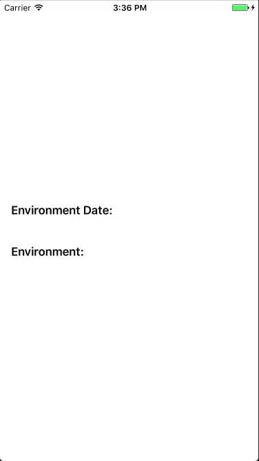
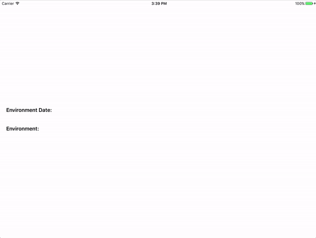

[](https://travis-ci.org/prolificinteractive/Yoshi)
[](https://img.shields.io/cocoapods/v/Yoshi.svg)
[](http://cocoadocs.org/docsets/Yoshi)
[](http://cocoadocs.org/docsets/Yoshi)
[](http://cocoadocs.org/docsets/Yoshi)
[](https://github.com/Carthage/Carthage)

## Description

A helpful companion for your iOS app.

Yoshi is a convenient wrapper around the UI code that is often needed for displaying debug menus.

### iPhone


### iPad


## Requirements

* iOS 8.0+
* Xcode 8.0+

## Installation

### CocoaPods
Yoshi is available through [CocoaPods](http://cocoapods.org). To install
it, simply add the following line to your `Podfile`:

###### Swift 4.2

```ruby
pod 'Yoshi'
```

###### Swift 3.0

```ruby
pod 'Yoshi', '2.2.2'
```

###### Swift 2.3

```ruby
pod 'Yoshi', '1.1.1'
```

###### Subspec

Starting from version 3, Yoshi provides implementations for some common debugging tasks and category them in its subspecs, including:

* [QAKit](Yoshi/QAKit/README.md)

To install, specify the subspec in your project's Podfile:

```ruby
pod 'Yoshi', :subspecs => ['QAKit']
```

### Carthage
You can also add Yoshi to your project using [Carthage](https://github.com/Carthage/Carthage). Add the following to your `Cartfile`:

```ruby
github "prolificinteractive/Yoshi"
```

## Usage

To display Yoshi, simply set up the menu and present it.

```swift

// Setup the custom menus
Yoshi.setupDebugMenu([environmentMenu, instabugMenu, dateSelectionMenu])

// Invoke Yoshi
Yoshi.show()
```

By default, Yoshi will display your app's icon, along with the current build and version number.

Yoshi can be set up to display any sort of menu as long as the menu object conforms to `YoshiGenericMenu`. Action menu and single selection menus are available out of the box, with several easy-to-conform menu protocols providing flexibility to customize the cells.

### Action Menu

Action Menu is the simplest Yoshi menu able to execute custom events when tapped.

For example, we can invoke [Instabug](https://instabug.com) when a custom menu is selected.

```swift
let instabugMenu = YoshiActionMenu(title: "Start Instabug",
                                   subtitle: nil,
                                   completion: { Instabug.invoke() })
```

### Single Selection Menu

To display a single selection menu, just construct a `YoshiSingleSelectionMenu` with necessary information as below:

```swift

// Build necessary options.
let option1 = YoshiSingleSelection(title: "Option1", subtitle: "Select to push")
let option2 = YoshiSingleSelection(title: "Option2", subtitle: "Select to present")
let option3 = YoshiSingleSelection(title: "Option3", subtitle: "Select to dismiss")
let options: [YoshiTableViewMenuItem] = [option1, option2, option3]

// Construct YoshiSingleSelectionMenu.
let singleSelectionMenu = YoshiSingleSelectionMenu(title: "Options",
                                                   options: options,
                                                   selectedIndex: 0,
                                                   didSelect: { selection in /*Select the option based on selection*/ })
```

Yoshi will take care of managing selections and call back the convenient closure function when a new selection is made.

### Date Selector Menu

To present a date selector menu, create a type that conforms to `YoshiDateSelectorMenu` protocol

```swift
final class DateSelectorMenu: YoshiDateSelectorMenu {

    var title: String
    var subtitle: String?
    var selectedDate: Date
    var didUpdateDate: (dateSelected: Date) -> ()

    init(title: String,
         subtitle: String? = nil,
         selectedDate: Date = Date(),
         didUpdateDate: (Date) -> ()) {
        self.title = title
        self.subtitle = subtitle
        self.selectedDate = selectedDate
        self.didUpdateDate = didUpdateDate
    }

}
```

```swift
let dateSelectorMenu = DateSelectorMenu(title: "Environment Date",
    subtitle: nil,
    didUpdateDate: { (dateSelected) in
      // Do something with the selected date here
})
```

### Submenu

If you find your debug menu getting out of hand, you can organize it into submenus. To do so, just create a type that conforms to YoshiSubmenu:


```swift
final class Submenu: YoshiSubmenu {

    let title: String

    let subtitle: String?

    let options: [YoshiGenericMenu] {

}
```

```swift
let integrationsSubmenu = Submenu(title: "Third Party Integrations",
    subtitle: nil,
    options: [
        instabugMenu,
        crashlyticsMenu
    ]
)
```

### Invocation Options

Yoshi can be invoked with a number of different options. The simplest way is to manually invoke using the `show()` function.

```swift
Yoshi.show()
```

In addition to the vanilla invocation option, Yoshi can also be invoked in response of 3 different options of motion or touch events.   
If you want to enable all of those 3 following options you can simply pass the `all` option to the `setupDebugMenu`, although this option is already the default one.

```swift
Yoshi.setupDebugMenu([/* YoshiMenu items */], invocations: [.all])
/// Or simply
Yoshi.setupDebugMenu([/* YoshiMenu items */])
```

To specify which option you want exactly you just need to pass the ones you want to the `setupDebugMenu` function like this:

* To invoke Yoshi in response to a shake-motion gesture, add the `shakeMotionGesture` option in the `setupDebugMenu` invocations parameter as follows.

```swift
Yoshi.setupDebugMenu([/* YoshiMenu items */], invocations: [.shakeMotionGesture])
```

* To invoke Yoshi in in response to a multi-touch event, add the `multiTouch` option in the `setupDebugMenu` invocations parameter as follows.

```swift
Yoshi.setupDebugMenu([/* YoshiMenu items */], invocations: [.multiTouch])
```

* Finally, to invoke Yoshi in response to a 3D touch event, add the `forceTouch` option in the `setupDebugMenu` invocations parameter as follows.

```swift
Yoshi.setupDebugMenu([/* YoshiMenu items */], invocations: [.forceTouch])
```

### Extra features

#### Clipboard copy
Long press on any cell of the Yoshi Menu to copy the subtitle.

#### Custom your cell UI

You can custom Yoshi menu cells using nib file or programmatically.   
To do so, simply create a `YoshiGenericMenu` and a `YoshiResuableCellDataSource`:

To support custom UI, first, provide a `YoshiResuableCellDataSource` instance referencing to your custom cell.      

* With Nib file

```swift
private final class CustomMenuCellDataSource: YoshiResuableCellDataSource {

    static var nib: UINib? {
        // Return your Nib file here
        return UINib(nibName: "CustomCell", bundle: nil)
    }

    func cellFor(tableView: UITableView) -> UITableViewCell {
    	// Dequeue and cast the cell here like you would normally did
        guard let cell = (tableView.dequeueReusableCell(withIdentifier: CustomMenuCellDataSource.reuseIdentifier)) as? CustomCell else {
            fatalError()
        }
        // config your cell here
        cell.label.text = "This is a custom cell"
        return cell
    }
}
```

* Without Nib file

```swift
private final class CustomMenuCellDataSource: YoshiResuableCellDataSource {

	func cellFor(tableView: UITableView) -> UITableViewCell {
    	// Dequeue the cell here like you would normally did, handle the case when deque failed
        guard let cell = (tableView.dequeueReusableCell(withIdentifier: CustomMenuCellDataSource.reuseIdentifier) ??
            UITableViewCell(style: .subtitle, reuseIdentifier: CustomMenuCellDataSource.reuseIdentifier)) as? CustomCell else {
                fatalError()
        }
        // config your cell here
        cell.label.text = "This is a custom cell"
        return cell
    }
}
```

Then, provide the menu that conforms to `YoshiGenericMenu` referencing to the data source.

```swift
struct MenuWithCustomUI: YoshiGenericMenu {

    var cellSource: YoshiResuableCellDataSource {
        return CustomMenuCellDataSource()
    }

    func execute() -> YoshiActionResult {
        // Do soomething here when the cell is tapped
        return .Handled
    }
}
```

Finally, display this custom menu like a normal Yoshi menu.

```swift
Yoshi.setupDebugMenu([MenuWithCustomUI()])
Yoshi.show()
```

## Contributing to Yoshi

To report a bug or enhancement request, feel free to file an issue under the respective heading.

If you wish to contribute to the project, fork this repo and submit a pull request. Code contributions should follow the standards specified in the [Prolific Swift Style Guide](https://github.com/prolificinteractive/swift-style-guide).

## License


Copyright (c) 2017 Prolific Interactive

Yoshi is maintained and sponsored by Prolific Interactive. It may be redistributed under the terms specified in the [LICENSE] file.

[LICENSE]: ./LICENSE
